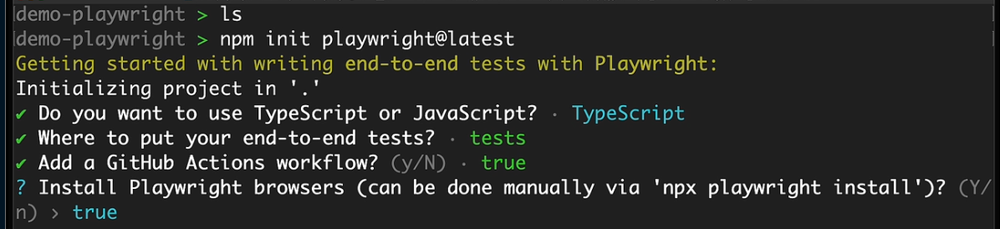

# 

- 主要概念

- 安装

- 配置

- 使用情况

## 模板演示




```js
npx playwright test //开始执行测试文件中的测试
npm playwright show-report // 启动网络服务器,并在浏览器中打开报告
```

## 文件夹介绍


1. [tests]文件中包含测试文件
2. [playwright.config.ts]
   1. 设置测试文件路径
   2. 设置可加载的浏览器
3. [github]github操作使用,便于github上执行测试(多人测试)


## vscode

1. Playwright Test for VSCode(安装TS的扩展)

